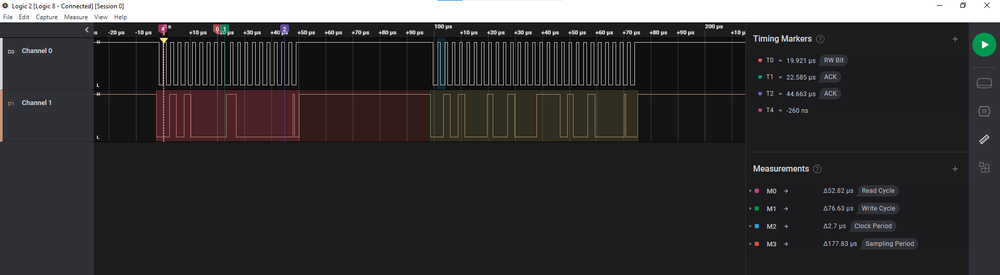

# Assignment 3

- What is the duration of an I2C write cycle?

- What is the duration of an I2C read cycle?

- What is the adjusted I2C clock rate?

- What is the sampling period, i. e. the time it takes to request and receive a new ADC value?
